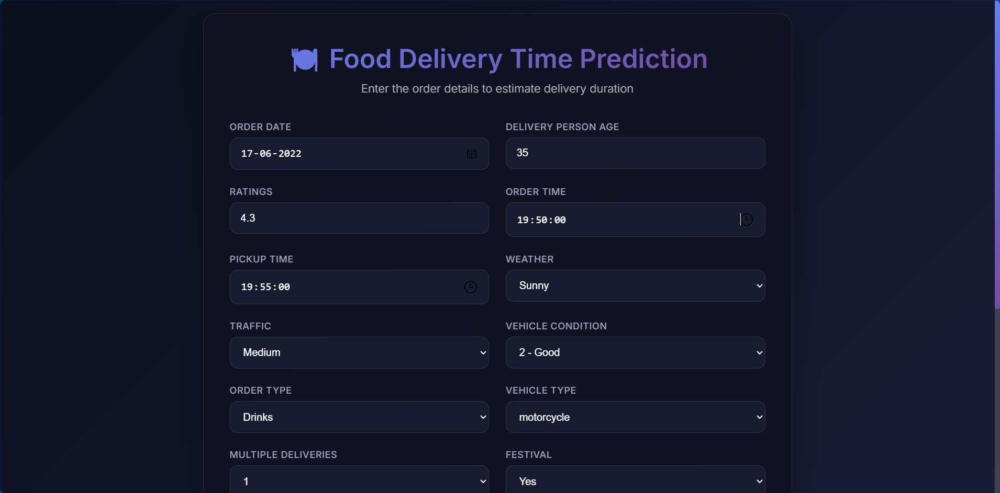

# 🚴‍♂️ Food Delivery Time Prediction

## 🧩 Problem Statement

Food delivery is a growing part of the modern food industry, where restaurants, stores, or independent couriers deliver meals and grocery items directly to customers. However, one major challenge for both customers and businesses is **predicting accurate delivery times**.
Uncertain delivery durations can lead to customer dissatisfaction, poor resource allocation, and logistical inefficiency.

This project aims to build a **machine learning model** that predicts the **estimated delivery time** based on various real-world features such as:

* Delivery person’s age, rating, and vehicle condition
* Traffic density and weather conditions
* Type of order, distance, and time of day

In large-scale delivery ecosystems, unpredictable factors such as **real-time traffic patterns**, **weather disruptions**, **restaurant preparation delays**, and **route deviations** can create high variance in actual delivery times. These unpredictable conditions make it difficult for logistic platforms to offer consistent and reliable time estimates to users. Over- or underestimations not only frustrate customers but can also cause inefficiencies in rider scheduling, leading to idle time or overload.

Moreover, most existing prediction systems rely on **static or historical averages**, which fail to adapt dynamically to context-specific changes such as lunch/dinner rush hours, peak traffic windows, or sudden rainstorms. Hence, a **robust, data-driven predictive model** that learns from historical data and adapts to real-time features is crucial. Such a system enhances customer trust, optimizes workforce management, and improves operational efficiency.

---

## 💡 Motivation

In today’s fast-paced world, **timely deliveries** are critical to customer experience.
Restaurants and delivery services often rely on rough estimations or averages that don’t adapt to real conditions.
By applying data-driven predictions, this project helps:

* Customers get more **accurate delivery time estimates**
* Businesses **optimize operations and workforce**
* Reduce **customer complaints and cancellations**

---

## 🚀 Solution Overview

The solution combines **data preprocessing**, **feature engineering**, and **machine learning** to create a prediction pipeline.
It is integrated with a simple **FastAPI web application**, where users can input details such as order time, traffic conditions, and delivery person details to get a **predicted delivery duration**.

The pipeline leverages a combination of **supervised learning models** (such as Gradient Boosting, Random Forest, and LightGBM, HistGBM, Linear regression) and **stacking techniques** to improve accuracy. During preprocessing, missing values, outliers, and categorical encodings are handled systematically. Custom feature engineering transforms raw inputs into actionable insights — for instance, deriving **travel distance** from geolocation data, computing **order rush factors** from time-of-day, and incorporating **traffic/weather embeddings** from external APIs.

The solution architecture also follows **industry-standard modular design**, where data ingestion, transformation, model training, and inference are separated into reusable components. The FastAPI app acts as a bridge between users and the model, offering a **real-time, low-latency REST API** with Pydantic validation.

The implementation emphasizes **Pydantic-based data validation** for robust schema enforcement and type safety, ensuring all API inputs and outputs adhere to strict contracts. The codebase is structured into **modular, industry-grade pipelines**, enabling seamless integration of data ingestion, feature processing, model training, and serving components. The entire application is **Dockerized**, providing environment consistency, portability, and simplified deployment across development, staging, and production environments.

---

## Getting Started

1. Clone the repo
2. Create a virtualenv and install requirements (`pip install -r requirements.txt`)
3. Launch FastAPI app: `uvicorn app.main:app --reload`
4. Visit the UI to try predictions

---
